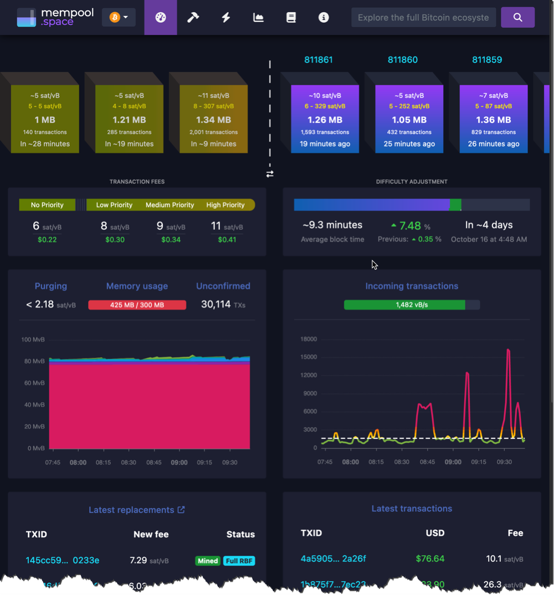
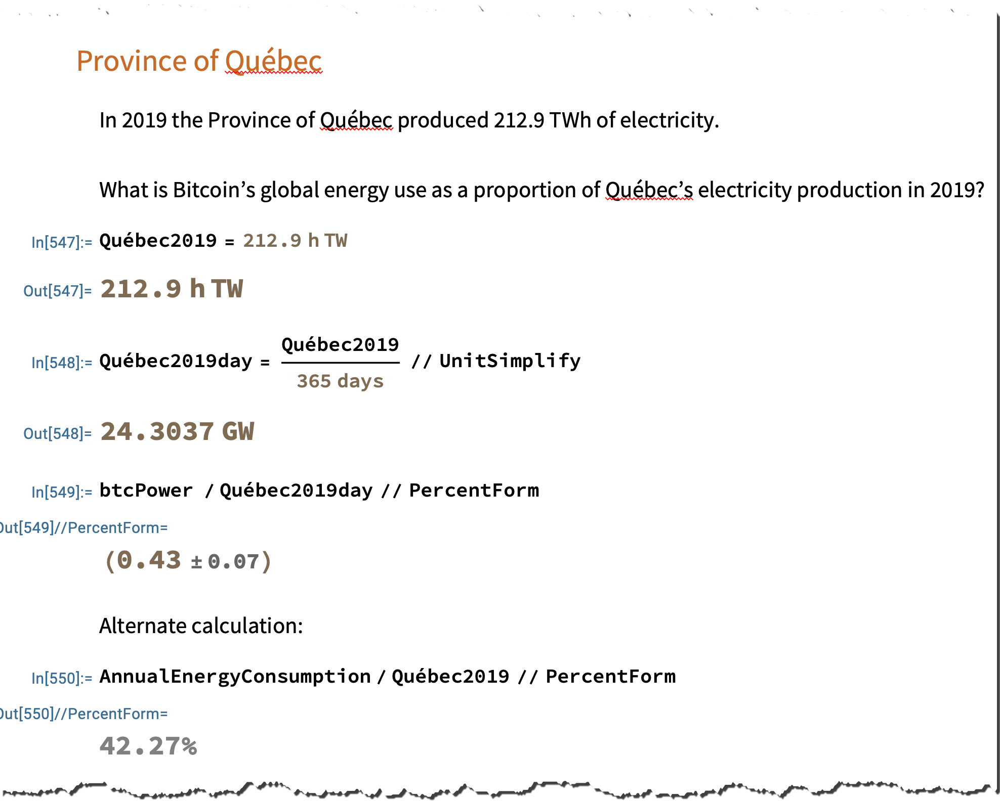
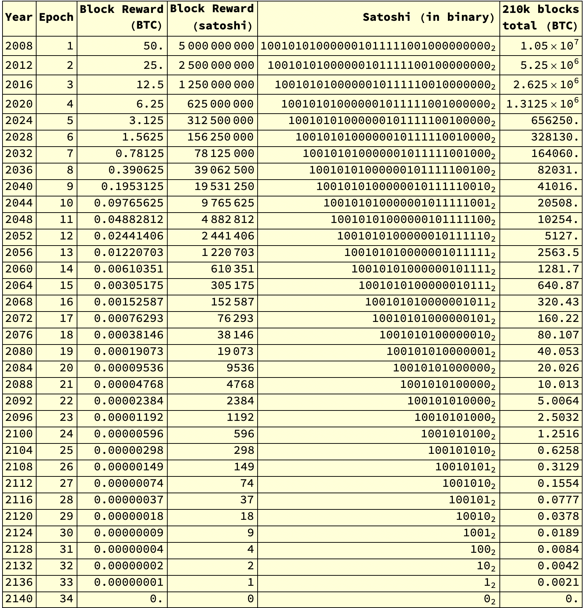

# Hackfest 2023

These are the notes for my [Hackfest 2023](https://hackfest.ca/) presentation on
October 12 2023 in Lévis, Québec.

The topic is presented in French. The title of the presentaton is
"***Bitcoin: Cool et pas à peu près***" which is colloquial French for
"***Bitcoin: Cool and not nearly***".  Which means, in essence,
*Bitcoin is pretty cool*.

The aim of the session is to explain Bitcoin while highlighting its cooler
technical facets. In 45 minutes or less.

## Session outline

1. [Introduction](#introduction)
1. [Epistemology of Bitcoin (some high level conclusions)](#epistemology-of-bitcoin-some-high-level-conclusions)
1. [BTC, satoshis, and unit bias](#btc-satoshis-and-unit-bias)
1. [Hashing, blocks, proof of work, and mining](#hashing-blocks-proof-of-work-and-mining)
1. [Bitcoin's heartbeat: Block time, mining difficulty, and mining difficulty adjustments](#bitcoins-heartbeat-block-time-mining-difficulty-and-mining-difficulty-adjustments)
1. [Halving and issuance](#halving-and-issuance)

### Introduction

Here I extemporaneously explain who I am, why I'm here, and what I'm going to
talk about. You had to be there.

### Epistemology of Bitcoin (some high level conclusions)

Why is it so hard to explaining Bitcoin sometimes hard? Understanding Bitcoin
certainly has a learning curve.

It feels like understanding Bitcoin requires a certain *activation energy*, with an
elevated  "hump" that dissuades many people from fully understanding it initially.

It's like an endothermic reaction in chemistry, where there's typically an energy
hump that needs to be overcome before the reaction can proceed.


The other thing about explaining Bitcoin is that it's a broad subject with orthogonal
facets.  Explaining Bitcoin involves explaining disparate things that are
***related***, but ***not correlated**.  This makes it hard to know where to start.
An obvious linear and logical narrative doesn't appear to exist.  One finds oneself
having to circle back to the beginning to introduce a new primitive concept, then
moving forward with the combined abstractions, again and again.

**Explaining Bitcoin sometimes feels like a Tarantino movie**, where the story is
told in a non-linear fashion.

|  |      |
| ---- | ---- |

#### Analyzing Bitcoin subject matter

Here we try to picture and resolve why Bitcoin is so hard to explain.  We start by
picking 21 facets to be explained. We could have picked 40 facets, but 21 is ample
for now.

If we list Bitcoin's salient subjects, and cross-reference among them for prerequisite
relationships, we get a table that looks like this.


**All matrices can be represented as a graph network**. Here's the graph network of these prerequisite relationships. What a mess! Where to start
to explain Bitcoin in a coherent way?


Let's see a **layered graph layout** to visualize the subject prerequisite
relationships. This is a little better, but it's still a mess.


We can **analyze the network graph for cliques**. This is interesting because
it shows how some concepts are more tightly related.  This seems to be is a promising
starting point for segmenting the subject matter.


What if we score subjects for their prerequisite value, their complexity (the number
of prerequisites), and subtract the complexity score from the prerequisite value?

In other words, the strategy is to start with the subjects that have the highest
prerequisite value, and the lowest complexity.

This gives us a pretty nice roadmap! The third column in this table leads with the
simpler subjects that partially unlock the greatest number most complex subjects.

|   prerequisite value (P)  | complexity (C)  | P - C  |
| ---- | ---- | ---- |
|  |  |  |

So let's run in that order, more or less.

### BTC, satoshis, and unit bias

Bitcoin values are expressed in satoshis. 1 BTC is 100,000,000 satoshis. This is why
we see at most 8 decimals in Bitcoin values.


Note that, when we express a monetary value denominated in BTC, we typically get a
decimal value. Fun fact: this is the ONLY place in the Bitcoin universe where we see
a real number, or a decimal of any sort. Bitcoin world is all about integer values only.


You may have heard something to the effect that ***"Bitcoin is at the leading edge of
mathematics, cryptography, and computer science"***.  This is a little bit of an
overstatement.

For example, **here are some math symbols you won't see in Bitcoin**:

```
≈   𝝅   ℯ   i   √   ∂x/∂t   ∫   Σ   ∏   μ   σ   n!   ε   ∞   ÷
```

You also **won't find any vectors** and **no matrices** either. There are **no angles**,
there is no **trigonometry**. There are **no imaginary numbers**.  There are
**no negative numbers** either. There are **no fractions**.  There are
**no decimals** and, therefore, **no irrational** numbers.

Bitcoin's math is actually accessible to anyone who has completed grade 8 math.

As for cryptography, **nothing is encrypled** in Bitcoin, so there's **nothing to
decrypt** either. The cryptography primitives used by the Bitcoin network is
all about hashing and digital signatures, which widely accessible subjects, and
certainly not at all "at the leading edge of cryptography."

### Hashing, blocks, proof of work, and mining

We explain the following concepts using
[Anders Brownworth's most excellent blockchain demo](https://github.com/anders94/blockchain-demo)
running locally.

* hashing
* blocks and blockchains
* proof of work
* mining


We also take a quick tour though [mempool.space](https://mempool.space/)



### SIDEBAR: How much mining is presently going on?

I don't plan on covering this diring the talk. I add this here because I think it's
good to be familiar with all this.

According to [Clark Moody's Bitcoin Dashboard](https://bitcoin.clarkmoody.com/dashboard/),
on October 8, 2023, there is 422 exahashes per second (EH/s) of mining activity on
the Bitcoin network over the last 2016 bkocks.

Which means, miners are presently executing 422 * 10^18 hashes per second.


#### Calculating the electrical power consumption of the Bitcoin network

A [Bitmain Antminer S19 Pro (110 TH)](https://www.asicminervalue.com/miners/bitmain/antminer-s19-pro-110th)
mining rig is capable of 110 TH/s while consuming 3250 Watts of electrical power.  Which means, presuming this
rig is typical (it's close), there would be 3,800,000 of these rigs mining Bitcoin presently, consiming
12,350,000 Watts (12.4 GW) of electrical power.

In comparison, the LG-2 power generating station in Baie James is capable of
generating 5,616 MW (5.6 GW) of
electrical power.  Which means, the Bitcoin network is presently consuming **the equivalent
of about 2.2 LG-2 power generating stations**.

(from financial constraints)

See the caculations in file [btc-energy-use.pdf](btc-energy-use.pdf)

In short, global Bitcoin energy use is equivalent to 40-50% of the electrical power
production of the province of Quebec.



### Bitcoin's heartbeat: Block time, mining difficulty, and mining difficulty adjustments

The bitcoin network strives to generate a new block every 10 minutes.  This is called the "block time".  

The block time is controlled by the mining difficulty, which is adjusted every 2016 blocks in order to reset the 
block time to 10 minutes based on mining activity over the previous 2016 blocks.


Why is the bitcoin network over 35,000 blocks ahead of its target pace?  Because resetting the mining difficulty 
adjusts the pace of production, but does not *compensate* for over and under production.  Given the increasing
hashrate trend (see below), the blockchain tends to become ahead of schedule.


### Halving and issuance

Bitcoin issuance is controlled and limited by a systematic gradual reduction of the block
reward.  This is called the "halving", which occurs every 210,000 blocks.

The first block reward was 50 BTC, which is 5 billion satoshi. In 2016 the block reward was
"halved" to 25 BTC, then 12.5 BTC in 2016, and 6.25 BTC in 2020.

How does "halving" ever get to zero? And didn't we say earlier that there are no division
operations in bitcoin?  Actually the block reward is not halved by division, but by bit
shifting.  The block reward is an integer value, and removing bits, one by one, is
equivalent to dividing by 2 each time.

The value of 5 billion satochi — 50 BTC — is represented in binary as follows:

```
100101010000001011111001000000000
```

Every 210,000 blocks, one bit gets dropped from the right side of the binary value.
This is equivalent to dividing by 2, wrapped in a `floor()` function so it rounds
down when the dropped bit is `1`.

Here is a table of the halving epochs, and the block reward in BTC and satoshi.



It's notable that the sum of all block rewards is just under 21 million BTC, \!\(
20,999,999.9769 BTC to be precise.)


## Resources

These are links to things I referenced during the presentation.

* [The Animated Elliptic Curve](https://curves.xargs.org/)

* [Anders Brownworth's blockchain demo](https://github.com/anders94/blockchain-demo)

* [Clark Moody Bitcoin Dashboard](https://bitcoin.clarkmoody.com/dashboard/)

* [Mempool.space](https://mempool.space/) (a block explorer and mempool visualizer)

* [Transaction Street](https://txstreet.com/v/btc-eth) (a block explorer and mempool
visualizer that's just, well, cool)
