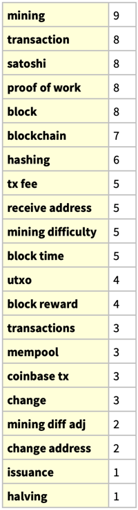

# Hackfest 2023

These are the notes for my [Hackfest 2023](https://hackfest.ca/) presentation.

## Session outline

1. [Introduction](#Introduction)
1. [Epistemology of Bitcoin (some high level conclusions)](#Epistemology-of-Bitcoin-(some-high-level-conclusions))
1. [BTC, satoshis, and unit bias](#BTC,-satoshis,-and-unit-bias)
1. [Hashing, blocks, proof of work](#Hashing,-blocks,-proof-of-work)
1. [Block time, mining difficulty, and mining difficulty adjustments](#Block-time,-mining-difficulty,-and-mining-difficulty-adjustments)
1. [Bitcoin's heartbeat, and mining difficulty adjustments](#Bitcoin's-heartbeat,-and-mining-difficulty-adjustments)
1. [Halving and issuance](#Halving-and-issuance)

### Introduction

todo.

### Epistemology of Bitcoin (some high level conclusions)

Why does it feel like explaining Bitcoin is so hard? It feels like
understanding Bitcoin has a high activation energy, with an elevated  "hump" that dissuades many people from understanding it.

If we list Bitcoin's salient subjects, and cross-reference among them for
prerequisite relationships, we get a table that looks like this.

**All matrices can be represented as a graph network**. Here's the graph network of these prerequisite relationships. What a mess! Where to start 
to explain Bitcoin in a coherent way?

Let's use a **layered graph layout** to visualize the subject prerequisite relationships. This is a little better, but it's still a mess.

We can analyze the network graph for cliques. This is interesting, because
it shows how some concepts are more tightly related than others.  This 
seems to be is a good starting point for explaining Bitcoin.

What if we score subjects for their complexity, their prerequisite value, and subtract prerequisite value from complexity score? This gives us a pretty nice roadmap.

|   complexity (C)  |  prerequisite (P)   | C - P  |
| ---- | ---- | ---- |
|  |  |  |

### BTC, satoshis, and unit bias

### Hashing, blocks, proof of work

### Block time, mining difficulty, and mining difficulty adjustments

### Bitcoin's heartbeat, and mining difficulty adjustments

### Halving and issuance

## Resources

These are links to things I referenced during the presentation.

- [The Animated Elliptic Curve](https://curves.xargs.org/)

- [Anders Brownworth's blockchain demo](https://github.com/anders94/blockchain-demo)

- [Clark Moody Bitcoin Dashboard](https://bitcoin.clarkmoody.com/)

